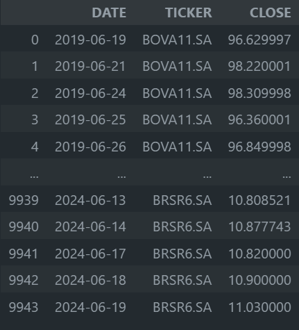
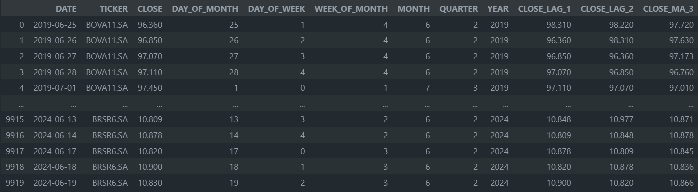

# Tree-based Forecasting Boilerplate
## Overview
This repository serves as a comprehensive boilerplate for data science projects focusing on multi-step forecasting using tree-based models from the `scikit-learn` library. It includes utilities for feature engineering, data collection, model training, and making iterative predictions, facilitating a streamlined approach to predictive modeling.

### Repository Structure
Below is a description of each folder and its purpose within the project structure:

| Folder | Description  |
| :------------ | :------------ |
|  `models`  |  Contains saved ``.joblib`` model files that can be used for predictions. |
|  `notebooks` | Jupyter notebooks for exploratory data analysis and visualization.  |
|  `reference` | Documentation and reference papers relevant to the project.  |
|  `reports` | Generated analysis reports and visuals.  |
|  `scripts` | Python scripts for running the `main` components of the pipeline.  |
|  `src` | Source code for the project including modules for feature engineering, data handling, and more.  |

### Data Description
#### Raw Dataframe
The raw dataframe used in this example has the following structure:

* DATE: The datetime marking each entry.
* <CATEGORY_COL>: Any type of categorical feature that distinguishes different time series from each other.
* <TARGET_COL>: The target variable for forecasting.

This boilerplate example uses stock prices from the Brazilian Market, extracted using the Yahoo Finance API:
CATEGORY_COL: TICKER
TARGET_COL: CLOSE

#### Processed Dataframe
The processed dataframe includes:

* DATE: Standardized datetime format.
* <DATE_FEATURES>:
  - DAY_OF_MONTH
  - DAY_OF_WEEK
  - WEEK_OF_MONTH
  - MONTH
  - QUARTER
  - YEAR
* <CALCULATED_FEATURES>:
  - CLOSE_LAG_<ANY_LAG_NUMBER>
  -...
  - CLOSE_MA_<ANY_MA_NUMBER>
  -...
* <CATEGORY_COL>: Any type of categorical feature that distinguishes different time series from each other.
* <TARGET_COL>: The target variable for forecasting.

## Scripts Overview
Here is a brief on what each script does:

`run_data_acquisition.py`: Script to fetch or simulate data collection.
`run_feature_engineering.py`: Applies transformations and feature engineering on collected data.
`run_model_training.py`: Handles the training of the machine learning models.
`run_daily_evaluation.py`: Handles the model backtesting over the last predicted date, as soon as ground truth data is available (in the processed_df).
`run_inference.py`: Used for making predictions using the trained model.
`run_wfv.py`: Script for "walk-forward validation", useful in time-series predictions to simulate real-world application.

### Configuration File
The project uses a YAML configuration file (project_config.yaml) to manage settings and hyperparameters. Here’s what it typically contains:

* Data Paths: Directories for input data, intermediate data, and outputs.
* Model Parameters: Hyperparameters for the model training.
* Feature List: Specific features to be included in the model.
* Validation Settings: Configurations for how model validation should be performed.

## Deep Dive
Performing multi-step ahead forecasting with tree-based models can be cumbersome, so let's deep dive into this project's workflow.

### Feature Engineering Workflow Description
Let's dive into the feature engineering script ``feat_eng.py`` and outline the workflow for automatically creating lag features and moving averages, based on a given list of features. Here’s a comprehensive breakdown of the process:

#### Step 1: Configuration and Initialization

* **Configuration Loading**: The script starts by loading configuration settings, which include parameters such as the number of lags, the window size for moving averages, and the specific features to be processed.

* **Input Data Loading**: It loads the dataset which will be used for generating the new features. This data must include the target variable and any other variables specified in the features list.

#### Step 2: Lag and Moving Average Features Creation

* **Generating Lag Features**: This script automatically creates any number of lag features for the TARGET variable. All one needs to do is to add the features names in the format "<TARGET_COLUMN>_LAG_<lag_number>". For example, the default configuration has "**CLOSE**" as target column, and there are two lag features in the `features_list`: CLOSE_LAG_1, CLOSE_LAG_2, so the script will automatically create the LAG 1 and LAG 2 features. If one addes CLOSE_LAG_500, them the function will create the CLOSE_LAG_500 feature.

* **Calculating Moving Averages**: In addition to lag features, the script can also generate moving average features. This is done for the same set of features specified in the features_list and the process is the same. If one wants to create a feature of the last 15 periods moving average, just need to the "<TARGET_COLUMN>_MA_15" to the ``features_list``.

#### Step 3: Integration and Output

* **Combining Features**: Once all new features are generated, they are combined with the original dataset. This expanded dataset now includes the original features, the new lag features, and the moving average features.
* **Output**: The script outputs this comprehensive dataset, which is now ready for further analysis or model training. It is being written to a `csv` file.

### Iterative Forecasting Workflow Description
The iterative forecasting workflow in the predict_model.py script is designed to make predictions step-by-step, using tree-based models. Here's a comprehensive breakdown of the process:

#### Step 1: Initial Setup and First Prediction
* **Model Loading**: The script begins by loading a pre-trained tree-based model from a specified path. This model has been trained on historical data.
* **Data Preparation**: It then prepares the initial input data, which usually includes lag features derived from past observations of the target variable and other exogenous variables that might influence the forecast.
* **First step Forecast**: The model uses the original true values to make its first out-of-sample prediction. This prediction is for the next immediate time step (e.g., the next day or next hour).

#### Step 2: Iterative Predictions Using Lag Updates
* **Updating Lag and Moving Averages Features**: Once the first prediction is made, the script updates the feature set values to include this new prediction as a `'lag'` feature, as well as re-calculating the moving averages values.

	* `update_lag_features`: This function takes the most recent prediction and shifts the lag features accordingly. For example, if `lag_1` was yesterday’s actual value, after an update, `lag_1` becomes today's predicted value, and yesterday's `lag_1` shifts to `lag_2`.
  * `update_ma_features`: This function takes the most recent prediction and append it to the previous target values, then re-calculate the new moving average value.

* **Iterative Forecasting Loop**: This process repeats for as many steps as needed. Each iteration involves:

	* Using the updated features to make the next prediction.
	* Updating the lag features again using the latest prediction.
	* Updating the moving average features again using the latest predictions.

#### Step 3: Output
* **Storing Predictions**: Each forecast made in the iterative loop is appended to a list in order to consolidate the final predictions dataframe.

#### Utilities and Supporting Functions

* **Logging**: To keep track of the forecasting process, logging statements are often used to output information about the current state of the loop, errors, and other critical information.

## Usage
To use this repository, clone it locally and install the required dependencies as listed in requirements.txt. You can run the scripts individually based on your stage in the project pipeline. For example:

### Installation
`
python -m venv tree_forecasting
source tree_forecasting/bin/activate
pip install -r requirements.txt
`

### Running the complete (daily) pipeline
Ensure you modify the project_config.yaml as per your project needs before running the scripts.

`
python scripts/run_data_acquisition.py
python scripts/run_feature_engineering.py
python scripts/run_daily_evaluation.py
python scripts/run_model_training.py
python scripts/run_inference.py
`
### Running Walk Forward Validation on past data

`
python scripts/run_wfv.py
`